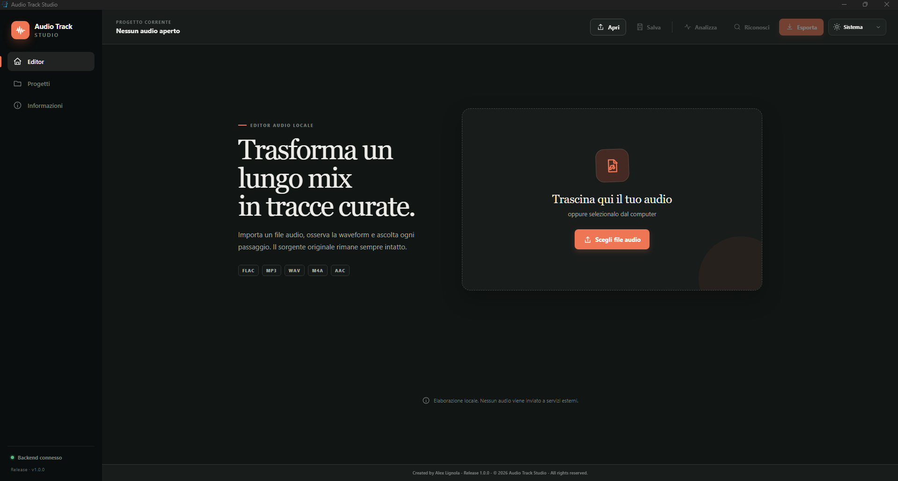

# Audio Track Studio

> Editor desktop locale per suddividere registrazioni audio lunghe in tracce curate.

[](https://github.com/AngoloInformatico/audio-track-studio/releases/latest)


[](LICENSE)



Audio Track Studio combina waveform interattiva, marker manuali e suggeriti, metadati,
copertine e progetti recuperabili in un'applicazione Windows. Il file sorgente non viene mai
modificato e le tracce vengono esportate in FLAC lossless.

## Funzionalità principali

- importazione FLAC, WAV, MP3, M4A e AAC;
- waveform zoomabile con riproduzione e marker modificabili al millisecondo;
- analisi locale di silenzi, energia e variazioni spettrali;
- suddivisione, unione e anteprima dei confini delle tracce;
- editor di artista, titolo, album, numerazione, genere, commenti e copertine;
- riconoscimento musicale opzionale tramite Chromaprint e AcoustID;
- esportazione asincrona in FLAC con avanzamento e annullamento;
- salvataggio, autosave e recovery dei progetti `.atsproject`;
- tema chiaro, scuro o di sistema;
- applicazione desktop Windows basata su pywebview e WebView2.

## Download

Scarica l'installer Windows oppure la versione portabile dalla pagina
[GitHub Releases](https://github.com/AngoloInformatico/audio-track-studio/releases/latest).

- `AudioTrackStudio-Setup-1.0.2.exe`: installazione consigliata per Windows 10/11 x64;
- `AudioTrackStudio-Portable-1.0.2.zip`: applicazione completa da estrarre e avviare;
- `SHA256SUMS.txt`: checksum per verificare l'integrità dei download.

La release non è firmata con un certificato Authenticode commerciale; Windows SmartScreen può
mostrare un avviso al primo avvio.

## Architettura

```text
backend/       API FastAPI, audio, analisi, recognition, export e progetti
frontend/      interfaccia React e TypeScript
desktop/       wrapper pywebview e server locale
packaging/     configurazione PyInstaller e installer Inno Setup
scripts/       strumenti di build e pubblicazione
Icon/          icona Windows
docs/          documentazione di sviluppo e screenshot
```

Il backend è esposto esclusivamente sull'interfaccia loopback. Editing, analisi, splitting,
esportazione e gestione dei progetti funzionano offline; soltanto AcoustID e il recupero delle
copertine possono accedere a Internet.

## Avvio in sviluppo

### Prerequisiti

- Python 3.11 o successivo;
- Node.js 20.19 o successivo;
- FFmpeg e ffprobe disponibili nel `PATH`;
- facoltativi: fpcalc/Chromaprint e una chiave applicazione AcoustID.

Da PowerShell, nella radice del progetto:

```powershell
py -3.13 -m venv .venv
.\.venv\Scripts\Activate.ps1
python -m pip install -r requirements-dev.txt
Copy-Item .env.example .env
python -m backend
```

In un secondo terminale:

```powershell
cd frontend
npm install
npm run dev
```

Aprire `http://127.0.0.1:5173`. La documentazione OpenAPI del backend è disponibile in sviluppo
su `http://127.0.0.1:8765/docs`.

## Verifiche

```powershell
py -3.13 -m pytest
py -3.13 -m ruff check backend
cd frontend
npm run lint
npm run test
npm run build
```

## Build Windows

Per creare la versione portabile e, se Inno Setup 6 è installato, l'installer:

```powershell
.\scripts\build_release.ps1 -Installer
```

In alternativa:

```powershell
py GeneraExe.py
```

Gli artefatti vengono generati in `release/` e non sono versionati nel repository. Per una
distribuzione pubblica è consigliato allegarli a una GitHub Release.

## Documentazione

- [Guida e specifica completa](README_GUIDA.md)
- [Sviluppo locale e test](docs/development.md)
- [Avvisi sulle dipendenze di terze parti](THIRD_PARTY_NOTICES.md)

## Licenza

Audio Track Studio è distribuito con licenza
[GNU General Public License v3.0](LICENSE). Puoi usare, studiare, modificare e ridistribuire il
software nel rispetto dei termini della GPLv3. Le dipendenze e i binari di terze parti mantengono
le rispettive licenze indicate in [`THIRD_PARTY_NOTICES.md`](THIRD_PARTY_NOTICES.md).
